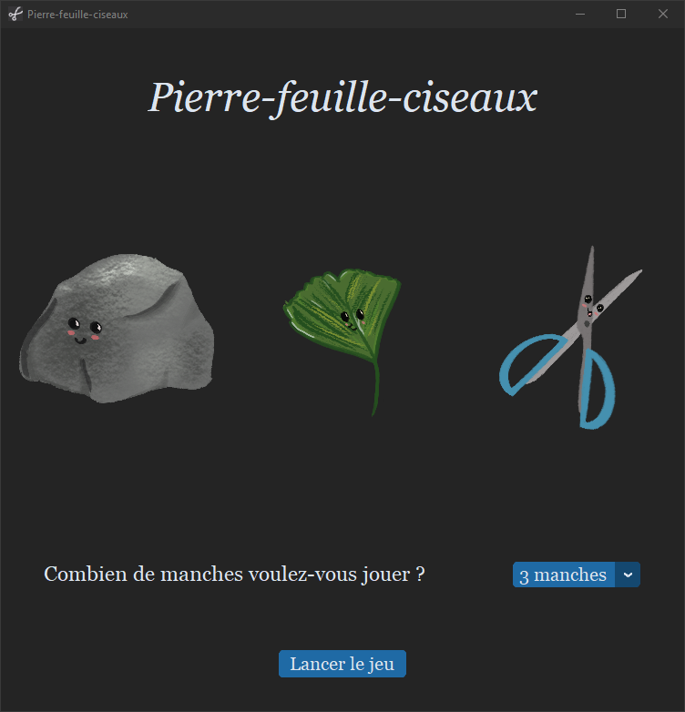

# Rock-leaf-scissors
A "rock-paper-scissors" inspired game with original design, developed with Tkinter.\
The classical "paper" item is replaced with a "leaf", based on a french double-meaning word ("feuille").

The app's theme follows the system theme automatically (dark/light).

*Dark theme*

*light theme*

## Dependencies
- **Python >= 3.7**
- **CustomTkinter** is a python UI-library based on Tkinter, with more modern and fully customizable widgets. The window and most of the widgets in the script are customtkinter objects.
- **Pillow** (PIL fork, Python Imaging Library) is used to manage images.
- **pygame** is a library for the development of multimedia applications using Python. It is used in the program to play sounds. It is quite a huge library for this simple purpose, but it is really simple to use.

If Python is not installed, you can use the package in the [release](https://github.com/popobg/Rock-leaf-scissors/releases/tag/v1.0).
